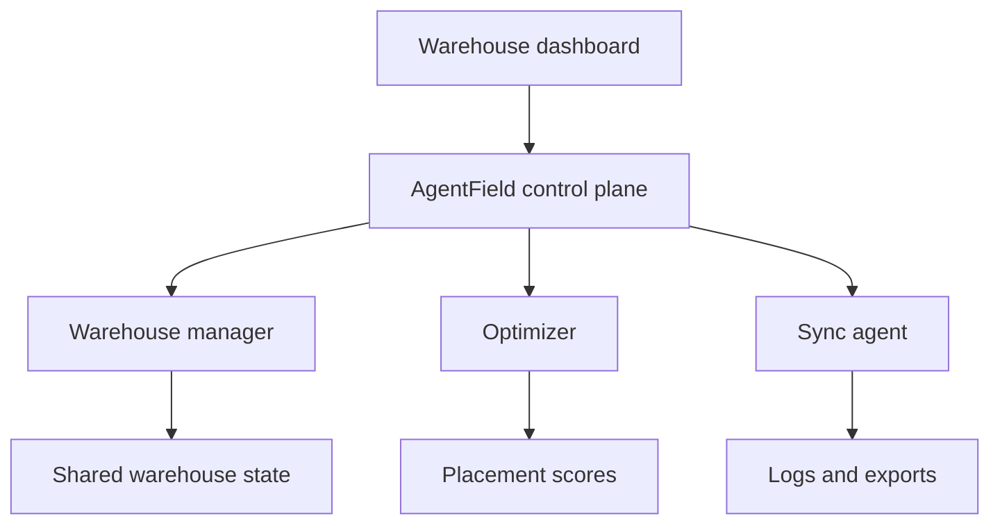

# StoreMax

A technical case study of a multi-agent warehouse optimization prototype built for the AgentField Hackathon.

StoreMax explored how coordinated agents could improve cargo placement, warehouse visibility, and operational handoffs.

## What We Built

- A warehouse manager agent that owns state and coordinates each optimization run
- An optimizer agent that scores placements by height fit and turnover priority
- A sync agent that records events and simulates warehouse management system exports
- A dashboard concept for rack configuration, execution logs, and placement results

## Workflow

1. Load warehouse rack, bin, and cargo definitions.
2. Start an optimization run through the warehouse manager.
3. Rank compatible bins using cargo height and turnover preferences.
4. Place compatible cargo and flag items that exceed available capacity.
5. Review the execution trail and export the resulting warehouse state.

## Architecture

## Repository Contents

This repository contains project documentation rather than runnable application source.

| Document | Contents |
| --- | --- |
| [Architecture overview](docs/architecture-overview.md) | Original system design covering the interface, agents, integration layer, and data services |
| [AgentField implementation](docs/agentfield-implementation.md) | Agent responsibilities, communication patterns, and implementation lessons |
| [Cloudflare architecture](docs/cloudflare-workers.md) | Original edge and container deployment design |
| [Getting started notes](docs/getting-started.md) | Environment and deployment notes for the original implementation; referenced source is not included here |

## License

StoreMax documentation is available under the [MIT License](LICENSE).
