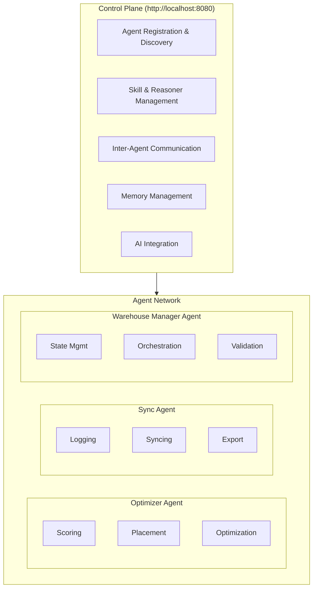

# AgentField Implementation Guide

## Overview

StoreMax leverages AgentField as the foundational platform for building and orchestrating intelligent warehouse management agents. The agents run in Cloudflare Containers, which provide serverless compute for Python-based agent systems, enabling seamless integration with Cloudflare Workers for request routing and orchestration. This document provides an in-depth look at how AgentField was used, the implementation patterns adopted, and the lessons learned throughout the development process.

## AgentField Architecture

### High-Level Design

## Agent Implementation

### 1. Optimizer Agent

**Purpose**: Calculates optimal cargo-to-bin placements using scoring algorithms.

**Key Responsibilities**:
- Calculate space efficiency scores
- Evaluate tier preferences based on turnover rates
- Sort cargo by priority
- Find optimal bin assignments
- Suggest reorganization strategies

**Implementation Details**:

The Optimizer Agent is configured with a low temperature AI model for consistent optimization results.

**Skills Implemented**:

1. **calculate_fit_score**: Evaluates space efficiency by calculating how well cargo fits into bins based on height ratios.

2. **calculate_tier_score**: Evaluates tier preferences based on turnover rates, giving bonuses for optimal placement.

3. **sort_cargo_by_priority**: Sorts cargo for optimal processing order, prioritizing fast turnover items and taller items first.

**Reasoners Implemented**:

1. **optimize_placements**: Main optimization algorithm that sorts cargo by priority and finds optimal bin assignments using scoring methods.

2. **suggest_reorganization**: AI-powered reorganization suggestions that identify inefficient placements and recommends improvements.

### 2. Sync Agent

**Purpose**: Manages event logging, data synchronization, and external system integration.

**Key Responsibilities**:
- Log all agent events for monitoring
- Maintain event history
- Export warehouse state to CSV
- Sync placements to external WMS

**Implementation Details**:

The Sync Agent is configured with a low temperature AI model for consistent results.

**Skills Implemented**:

1. **log_event**: Centralized event logging for all agent activities
2. **get_recent_logs**: Retrieve recent events for monitoring
3. **export_state_to_csv**: Export warehouse state to CSV files for reporting

**Reasoners Implemented**:

1. **sync_to_wms**: External WMS integration for syncing placements

### 3. Warehouse Manager Agent

**Purpose**: Orchestrates warehouse operations, manages state, and coordinates other agents.

**Key Responsibilities**:
- Load and manage warehouse data
- Validate and execute placements
- Orchestrate optimization process
- Handle rejected cargo
- Provide warehouse state queries

**Implementation Details**:

The Warehouse Manager Agent is configured with a moderate temperature AI model for balanced decision-making.

**Skills Implemented**:

1. **load_bins_from_csv**: Load storage bins from CSV file into memory
2. **get_warehouse_state**: Get complete warehouse state including utilization metrics
3. **validate_placement**: Validate if cargo can be placed in a specific bin
4. **execute_placement**: Execute validated cargo placements

**Reasoners Implemented**:

1. **orchestrate_optimization**: Main orchestration reasoner that coordinates the optimization process
2. **handle_rejection**: AI-powered handling of rejected cargo with alternative suggestions

## Inter-Agent Communication

### Communication Patterns

**1. Direct Agent Calls**

Agents can call each other's skills directly using the `app.call()` method for simple, synchronous operations.

**2. HTTP API Calls**

For more complex interactions, agents can make HTTP requests to the control plane for detailed responses.

**3. Memory Sharing**

Agents can share state through AgentField's memory system for consistent data access across the agent network.

## Cloudflare Containers Integration

### Container Architecture

StoreMax agents run in Cloudflare Containers, which provide serverless compute for Python-based agent systems. This architecture enables:

- **Language Flexibility**: Run Python agents alongside JavaScript Workers
- **Resource Isolation**: Each agent runs in isolated container environment
- **Dependency Management**: Full control over Python packages and versions
- **Scalability**: Auto-scale based on optimization workload
- **Global Deployment**: Deploy containers to Cloudflare's global network

### Container Configuration

Each agent is packaged as a Docker container with Python 3.10, dependencies installed from requirements.txt, and environment variables for configuration.

### Container Deployment

Agents are deployed to Cloudflare Containers using a workflow that includes building the container image, pushing to a container registry, configuring in wrangler.toml, and deploying with Wrangler.

### Worker-to-Container Communication

Cloudflare Workers communicate with agent containers through service bindings, allowing direct calls to container endpoints.

### Agent Container Endpoints

Each agent container exposes HTTP endpoints for Cloudflare Workers to call, providing optimization services and status information.

### Container Lifecycle Management

- **On-demand spin-up**: Container instances are created when Workers make requests
- **Auto-scaling**: Multiple instances based on optimization workload
- **Idle shutdown**: Containers stop after inactivity period (configurable via `sleepAfter`)
- **Stateless routing**: Requests routed to available instances
- **Session affinity**: Same session routed to same container instance

### Benefits of Container-Based Agents

1. **Language Independence**: Run Python agents without rewriting in JavaScript
2. **Full Python Ecosystem**: Access to all Python packages and libraries
3. **Resource Control**: Configure CPU, memory, and disk space per container
4. **Isolation**: Each agent runs in isolated environment
5. **Scalability**: Auto-scale based on demand
6. **Cost Efficiency**: Pay only when containers are running
7. **Global Edge**: Deploy containers to Cloudflare's global network

## Shared Schemas

All agents use shared Pydantic schemas for type safety and consistency, including models for storage bins, cargo, and system statuses.

## Lessons Learned

### 1. Agent Communication Patterns

**Challenge**: Determining the best way for agents to communicate.

**Lesson**: Use a combination of direct calls and HTTP requests:
- Use `app.call()` for simple, synchronous skill invocations
- Use HTTP requests for complex operations requiring detailed responses
- Implement fallback mechanisms for when agents are unavailable

**Best Practice**:

Use direct calls for simple operations with HTTP fallback for reliability.

### 2. State Management

**Challenge**: Managing state across multiple agents without a centralized database.

**Lesson**: Use AgentField's memory system as a shared state layer:
- Store frequently accessed data in memory for fast access
- Implement versioning for critical state updates
- Use in-memory storage as a fallback for development

**Best Practice**:

Implement versioning for critical state updates to maintain consistency.

### 3. Error Handling and Resilience

**Challenge**: Ensuring system reliability when agents fail or are unavailable.

**Lesson**: Implement comprehensive error handling:
- Wrap all inter-agent calls in try-except blocks
- Implement retry logic with exponential backoff
- Provide graceful degradation when agents are unavailable
- Log all errors for debugging

**Best Practice**:

Implement retry logic with exponential backoff for inter-agent communication.

### 4. Performance Optimization

**Challenge**: Optimizing performance for large-scale warehouse operations.

**Lesson**: Implement several optimization strategies:
- Use efficient data structures (lists, dictionaries, sets)
- Implement caching for frequently accessed data
- Batch operations when possible
- Use async/await for I/O operations

**Best Practice**:

Implement caching for frequently accessed data with appropriate TTL settings.

### 5. Testing and Debugging

**Challenge**: Testing distributed agent systems and debugging issues.

**Lesson**: Implement comprehensive testing strategies:
- Write unit tests for individual skills
- Write integration tests for agent interactions
- Use logging extensively for debugging
- Implement health checks for monitoring

**Best Practice**:

Implement health check endpoints for monitoring agent status.

### 6. Deployment Considerations

**Challenge**: Deploying and managing agents in production environments.

**Lesson**: Consider deployment requirements early:
- Use environment variables for configuration
- Implement graceful shutdown
- Provide startup and health check endpoints
- Use containerization for consistent deployment

**Best Practice**:

Use environment variables for configuration and implement graceful shutdown handling.

### 7. AI Integration

**Challenge**: Effectively integrating AI capabilities into agent workflows.

**Lesson**: Use AI strategically:
- Use AI for complex decision-making, not simple calculations
- Provide clear, structured prompts
- Implement fallback logic for AI failures
- Cache AI responses when appropriate

**Best Practice**:

Use structured AI prompts with clear instructions for consistent results.

### 8. Scalability Considerations

**Challenge**: Ensuring the system can scale to handle larger warehouses.

**Lesson**: Design for scalability from the start:
- Implement efficient algorithms (O(n) or better)
- Use pagination for large datasets
- Implement rate limiting to prevent overload
- Consider horizontal scaling for agents

**Best Practice**:

Implement pagination for large datasets to improve performance and reduce memory usage.

## Best Practices Summary

### Agent Design

1. **Single Responsibility**: Each agent should have a clear, focused purpose
2. **Loose Coupling**: Minimize dependencies between agents
3. **Clear Interfaces**: Define clear skill signatures with type hints
4. **Idempotency**: Design skills to be idempotent where possible

### Communication

1. **Error Handling**: Always wrap inter-agent calls in try-except blocks
2. **Timeouts**: Implement timeouts for long-running operations
3. **Logging**: Log all inter-agent communications for debugging
4. **Fallbacks**: Provide fallback mechanisms for critical operations

### State Management

1. **Versioning**: Version critical state updates
2. **Validation**: Validate all state changes
3. **Consistency**: Ensure state consistency across agents
4. **Persistence**: Implement persistence for critical state

### Performance

1. **Caching**: Cache frequently accessed data
2. **Batching**: Batch operations when possible
3. **Async**: Use async/await for I/O operations
4. **Monitoring**: Monitor performance metrics

### Security

1. **Validation**: Validate all inputs
2. **Sanitization**: Sanitize data before storage
3. **Authentication**: Implement authentication for sensitive operations
4. **Authorization**: Implement role-based access control

## Future Enhancements

1. **Advanced AI Integration**: Leverage more sophisticated AI models for optimization
2. **Real-time Analytics**: Implement real-time analytics and dashboards
3. **Predictive Optimization**: Use machine learning for predictive optimization
4. **Multi-warehouse Support**: Extend to support multiple warehouse locations
5. **Enhanced Monitoring**: Implement comprehensive monitoring and alerting
6. **Automated Testing**: Add automated testing for agent interactions
7. **Performance Optimization**: Further optimize performance for large-scale operations
8. **Enhanced Documentation**: Improve documentation with examples and tutorials

## Conclusion

AgentField provides a powerful platform for building intelligent, distributed agent systems. By following the patterns and best practices outlined in this document, developers can create robust, scalable, and maintainable agent-based applications.

The key lessons learned from implementing StoreMax highlight the importance of:
- Clear agent responsibilities
- Robust error handling
- Efficient state management
- Comprehensive testing
- Strategic AI integration

These principles, combined with AgentField's powerful features, enable the creation of sophisticated warehouse management systems that can adapt and scale to meet changing business needs.
