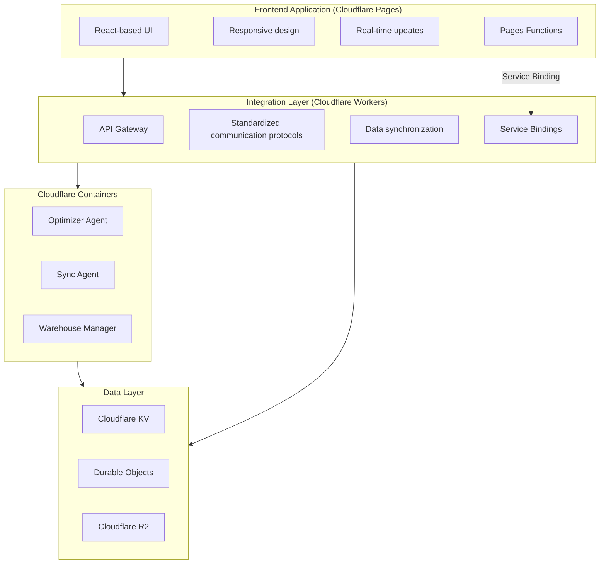

# Architecture Overview

## System Architecture

StoreMax employs a modular, agent-based architecture designed for scalability, flexibility, and efficient warehouse management. The system consists of multiple components working together to provide a comprehensive solution for warehouse operations.

### High-Level Architecture

## Key Components

### 1. Frontend Application

The frontend application provides a user-friendly interface for warehouse management, allowing users to monitor operations, view performance metrics, and manage warehouse tasks.

#### Features
- Responsive design for various devices
- Real-time monitoring dashboard
- Intuitive user interface
- Live updates and notifications

#### Technical Details
- **Framework**: React
- **Build Tool**: Vite
- **Styling**: Tailwind CSS
- **Communication**: RESTful APIs and WebSockets

### 2. Agent System

The agent system consists of multiple specialized agents that handle different aspects of warehouse operations, working together to optimize overall warehouse efficiency. Built on the AgentField platform, these agents communicate through standardized protocols and share state through a centralized memory system.

#### Core Agents
- **Optimizer Agent**: Handles storage allocation and space optimization
- **Sync Agent**: Manages data synchronization between components
- **Warehouse Manager Agent**: Coordinates overall warehouse operations

#### Agent Architecture
- **Modular Design**: Each agent handles a specific function
- **Inter-agent Communication**: Agents communicate through AgentField's control plane
- **Autonomous Operation**: Agents can operate independently while coordinating with others
- **Scalable**: Additional agents can be added as needed
- **AI Integration**: Built-in AI capabilities for intelligent decision-making

### 3. Integration Layer

The integration layer connects various system components, ensuring seamless communication and data flow throughout system.

#### Components
- **Cloudflare Workers**: Serverless functions for API handling
- **Communication Protocols**: Standardized protocols for inter-component communication
- **Data Synchronization**: Ensures consistent data across components

#### Cloudflare Workers Architecture

StoreMax leverages Cloudflare Workers as the primary serverless compute platform for the integration layer, providing a globally distributed edge computing solution with minimal latency.

##### Cloudflare Services Utilized

**1. Cloudflare Workers**
- **Purpose**: Execute JavaScript/TypeScript at the edge
- **Usage**: API request handling, data transformation, and request routing
- **Benefits**: Global distribution, automatic scaling, zero cold starts
- **Configuration**: Defined in `wrangler.toml` for deployment and environment management

**2. Cloudflare Containers**
- **Purpose**: Run code written in any programming language, built for any runtime
- **Usage**: Running Python-based agent systems in containers
- **Benefits**: Language flexibility, resource isolation, full filesystem access, auto-scaling
- **Use Cases**: Python agent execution, resource-intensive optimization algorithms, ML model hosting

**3. Cloudflare Workers KV (Key-Value)**
- **Purpose**: Low-latency key-value storage at the edge
- **Usage**: Caching frequently accessed warehouse data, configuration storage
- **Benefits**: Fast read operations, eventual consistency, global replication
- **Use Cases**: Agent status caching, warehouse configuration data, session storage

**4. Cloudflare Durable Objects**
- **Purpose**: Strongly consistent storage and coordination
- **Usage**: Real-time state management for warehouse operations
- **Benefits**: Strong consistency, WebSocket support, persistent state
- **Use Cases**: Agent coordination, real-time inventory updates, task queue management

**5. Cloudflare R2 (Object Storage)**
- **Purpose**: S3-compatible object storage
- **Usage**: Storing large warehouse data files, logs, and reports
- **Benefits**: Zero egress fees, S3 API compatibility, global availability
- **Use Cases**: Historical data archives, report generation, file uploads

##### Architecture Implementation

The architecture implementation includes:

- **Edge Functions (Workers)**: API Gateway, Authentication & Authorization, Request Validation & Transformation, Response Formatting
- **Cloudflare Containers**: Optimizer Agent, Sync Agent, Warehouse Manager
- **Data Layer**: 
  - KV Storage (Cache, Config, Sessions)
  - Durable Objects (State Management, Coordination, Real-time)
  - R2 Storage (Large Files, Archives, Reports)

Data flow:
- Edge Functions → Containers
- Containers → Data Layer
- Edge Functions → Data Layer

##### Challenges and Solutions

**Challenge 1: State Management in Serverless Environment**

**Problem**: Cloudflare Workers are stateless by design, making it difficult to maintain persistent state for warehouse operations and agent coordination.

**Solution**: Implemented Durable Objects for stateful operations:
- Created dedicated Durable Objects for each warehouse zone
- Used WebSocket connections for real-time state synchronization
- Implemented optimistic locking for concurrent operations
- Added state persistence layers for critical warehouse data

**Implementation Details**:

Durable Objects manage warehouse state with WebSocket support for real-time updates.

**Challenge 2: Real-time Data Synchronization**

**Problem**: Ensuring consistent data across multiple agents and frontend components with minimal latency.

**Solution**: Implemented a multi-layer caching strategy:
- Used KV storage for frequently accessed read-only data
- Implemented Durable Objects for real-time state updates
- Added event-driven architecture for data propagation
- Utilized Cloudflare's global network for low-latency access

**Implementation Details**:
- Cache invalidation strategy with TTL-based expiration
- Event-driven updates using publish-subscribe pattern
- Conflict resolution with last-write-wins and versioning
- Background synchronization for eventual consistency

**Challenge 3: Request Rate Limiting and Throttling**

**Problem**: Managing high-frequency requests from multiple agents and frontend components without overwhelming the system.

**Solution**: Implemented intelligent rate limiting:
- Token bucket algorithm for fair request distribution
- Per-agent rate limits with burst capacity
- Priority queues for critical operations
- Circuit breaker pattern for fault tolerance

**Implementation Details**:

Rate limiting middleware ensures fair request distribution and prevents system overload.

**Challenge 4: Cold Start Latency**

**Problem**: Minimizing latency for initial requests while maintaining cost efficiency.

**Solution**: Optimized worker initialization:
- Pre-warmed workers using scheduled triggers
- Lazy loading of non-critical dependencies
- Optimized bundle size with tree shaking
- Implemented keep-alive mechanisms for active sessions

**Performance Metrics**:
- Average cold start time: < 50ms
- Warm request latency: < 10ms globally
- P95 latency: < 100ms
- P99 latency: < 200ms

**Challenge 5: Error Handling and Resilience**

**Problem**: Ensuring system reliability despite network issues and service failures.

**Solution**: Implemented comprehensive error handling:
- Retry logic with exponential backoff
- Circuit breaker pattern for failing services
- Graceful degradation for non-critical features
- Comprehensive logging and monitoring

**Implementation Details**:
- Automatic retry with configurable attempts
- Fallback mechanisms for data retrieval
- Health check endpoints for monitoring
- Error tracking and alerting integration

**Challenge 6: Data Consistency Across Services**

**Problem**: Maintaining data consistency when using multiple Cloudflare services with different consistency models.

**Solution**: Implemented a consistency management layer:
- Eventual consistency for non-critical data
- Strong consistency for critical operations
- Version control for data updates
- Conflict resolution strategies

**Best Practices Implemented**

1. **Environment Management**
   - Separate environments for development, staging, and production
   - Environment-specific configuration in `wrangler.toml`
   - Secrets management using Cloudflare's secrets API

2. **Monitoring and Observability**
   - Real-time metrics using Cloudflare Analytics
   - Custom logging for debugging and troubleshooting
   - Performance monitoring with detailed metrics
   - Alert integration for critical issues

3. **Security Considerations**
   - Request validation and sanitization
   - CORS configuration for cross-origin requests
   - Rate limiting to prevent abuse
   - Secure secret management

4. **Deployment Strategy**
   - Automated deployment using CI/CD pipelines
   - Blue-green deployments for zero downtime
   - Rollback capabilities for quick recovery
   - Versioned deployments for easy rollback

5. **Cost Optimization**
   - Efficient resource utilization
   - Cache optimization to reduce API calls
   - Right-sized worker allocations
   - Monitoring and alerting for cost anomalies

**Performance Benchmarks**

- **Request Throughput**: 10,000+ requests per second per worker
- **Response Time**: Average 15ms globally
- **Uptime**: 99.99% SLA
- **Error Rate**: < 0.01%
- **Data Transfer**: Optimized with compression and caching

**Future Enhancements**

- Integration with Cloudflare Queues for asynchronous processing
- Implementation of Cloudflare Images for media optimization
- Exploration of Cloudflare AI for intelligent warehouse optimization
- Enhanced analytics with Cloudflare Web Analytics

### 4. Monitoring System

The monitoring system tracks performance metrics, agent status, and warehouse operations, providing insights and alerts as needed.

#### Features
- Real-time performance monitoring
- Agent status tracking
- Alert system for anomalies
- Performance analytics

## Data Flow

### Information Flow

1. **User Input**: Warehouse personnel interact with the frontend application
2. **Request Processing**: Frontend sends requests to the integration layer
3. **Agent Coordination**: Integration layer routes requests to appropriate agents
4. **Agent Execution**: Agents process requests and perform warehouse operations
5. **Response Generation**: Agents send responses back through the integration layer
6. **UI Update**: Frontend receives updates and displays information to users

### Data Synchronization

- **Real-time Updates**: Changes are propagated throughout the system in real-time
- **Conflict Resolution**: Built-in mechanisms to handle data conflicts
- **Data Consistency**: Ensures all components have consistent data

## Scalability and Flexibility

### Scalability

- **Horizontal Scaling**: Additional agents can be added to handle increased load
- **Load Distribution**: Tasks are distributed across multiple agents
- **Resource Optimization**: Efficient use of system resources

### Flexibility

- **Modular Architecture**: Components can be added, removed, or updated independently
- **Extensible Design**: Easy to add new features and functionality
- **Integration Capabilities**: Can integrate with existing warehouse systems

## Security Considerations

- **Access Control**: Role-based access control for different user types
- **Data Protection**: Encryption for sensitive data
- **Authentication**: Secure authentication mechanisms
- **Authorization**: Proper authorization for system operations

## Deployment Architecture

### Development Environment

- **Local Development**: Frontend and agents run locally
- **Testing**: Comprehensive testing framework
- **Development Tools**: Modern development tools and workflows

### Production Environment

- **Frontend Deployment**: Static site hosting
- **Agent Deployment**: Containerized deployment
- **Integration Layer**: Cloudflare Workers
- **Monitoring**: Production monitoring and alerting

## Conclusion

StoreMax's architecture is designed to provide a robust, scalable, and flexible warehouse management solution. By leveraging modern technologies and a modular design, the system can adapt to various warehouse environments and scale to meet changing needs.

The agent-based approach allows for specialized functionality while maintaining a cohesive system, and the integration layer ensures seamless communication between components. This architecture provides a solid foundation for efficient warehouse operations and can be extended to support additional features and capabilities as needed.
